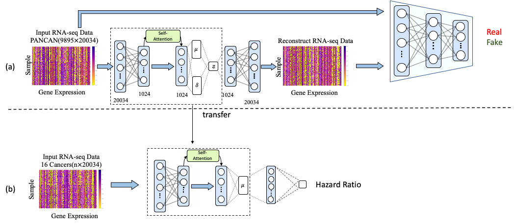

# SAVAE-Cox

SAVAE-Cox: A novel attention-mechanism based Cox survival model by exploiting pan-cancer empirical genomic information

## SAVAE-Cox Architecture



## Install

### Requirements

* Python 3
* Pytorch 1.8.1 or higher
* Install numpy, tqdm, scikit-learn, imblearn, pandas and lifelines
```
pip install numpy
pip install tqdm
pip install scikit-learn
pip install pandas
conda install -c conda-forge imbalanced-learn
conda install -c conda-forge lifelines
```
## Download dataset
Here, we provide a cleaned pan-cancer dataset and a dataset of 16 cancer types:

[Google Drive](https://drive.google.com/drive/folders/1KuDVRkPJZWYfQ2Z4YRxDo6e8lo5s68za?usp=sharing)
## Run Dimentional Reduction

```
python train_encoder.py
```

## Run Survival Analysis
```
python train_cox.py

```
## Citation
If you find this work useful for your research, please cite our paper
```
@article{meng2022novel,
  title={A Novel Attention-Mechanism Based Cox Survival Model by Exploiting Pan-Cancer Empirical Genomic Information},
  author={Meng, Xiangyu and Wang, Xun and Zhang, Xudong and Zhang, Chaogang and Zhang, Zhiyuan and Zhang, Kuijie and Wang, Shudong},
  journal={Cells},
  volume={11},
  number={9},
  pages={1421},
  year={2022},
  publisher={MDPI}
}
```
